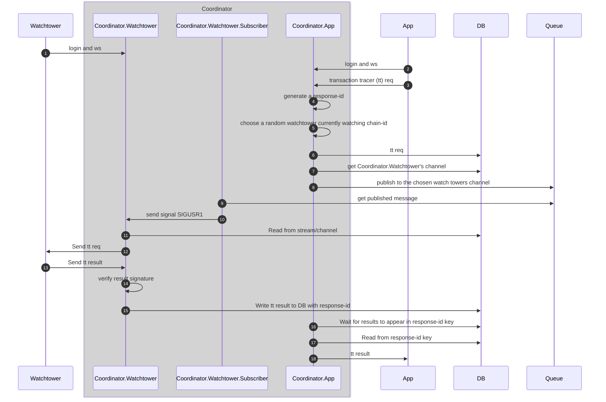

# sdk-python

This is the client to access the transaction tracer APIs.

# Transaction tracer flow

## Flow

```mermaid
sequenceDiagram
    autonumber
    participant Watchtower

    box LightGray Coordinator
        participant Coordinator.Watchtower 
        participant Coordinator.Watchtower.Subscriber


        participant Coordinator.App 

    end
    Watchtower ->> Coordinator.Watchtower : login and ws
    App ->> Coordinator.App : login and ws
    App ->> Coordinator.App : transaction tracer (tt) req
    Coordinator.App ->> Coordinator.App : generate a response-id
    Coordinator.App ->> Coordinator.App : choose a random watchtower currently watching chain-id
    Coordinator.App ->> DB : tt req
    Coordinator.App ->> DB : get Coordinator.Watchtower's channel
    Coordinator.App ->> Queue : publish to the chosen watch towers channel
    Coordinator.Watchtower.Subscriber ->> Queue : get published message
    Coordinator.Watchtower.Subscriber ->> Coordinator.Watchtower : send signal SIGUSR1
    Coordinator.Watchtower ->> DB : Read from stream/channel
    Coordinator.Watchtower ->> Watchtower : Send tt req
    Watchtower ->> Coordinator.Watchtower : Send tt result
    Coordinator.Watchtower ->> Coordinator.Watchtower : verify result signature
    Coordinator.Watchtower ->> DB : Write tt result to DB with response-id
    Coordinator.App ->> DB: Wait for results to appear in response-id key
    Coordinator.App ->> DB : Read from response-id key
    Coordinator.App ->> App : tt result
```
